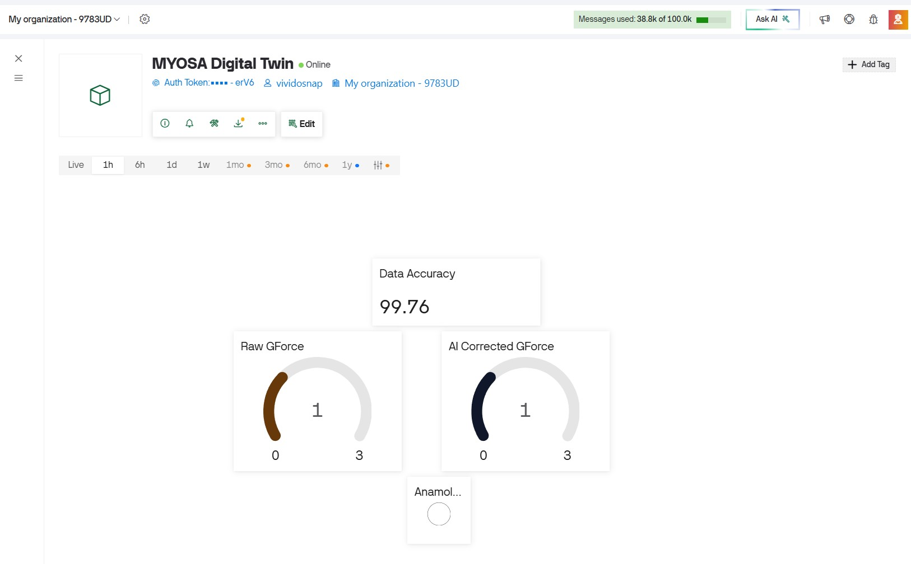

# Cyber-Physical Edge AI Digital Twin for Real-Time Structural Anomaly Detection

Welcome to the official repository tracking deployment assets for our Edge-AI framework built on the MYOSA architecture.

## 📁 Submission Directory Structure
To view the complete submission firmware source files, hardware system definitions, and analytical documentation required by the evaluation committee, please navigate directly into our target project module directory below:

### 👉 [Click Here to View the Main Project Workspace Folder](./myosa-digital-twin)

---

### 🖼️ Operational Highlights Overview

  
   
  <i>System Component Alpha: Live Cyber-Physical Sensor Array Mapping Metrics to the Virtual Twin Platform.</i>

---
### 🎥 Core Live Architecture Demonstration
Below is the embedded hardware verification recording mapping high-speed local processing reflexes and noise filtering loops:

<video controls width="100%">
  <source src="./system-demonstration.mp4" type="video/mp4">
</video>
